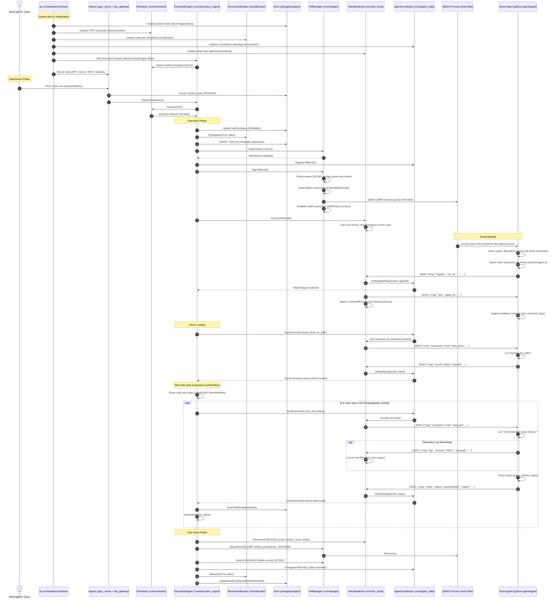
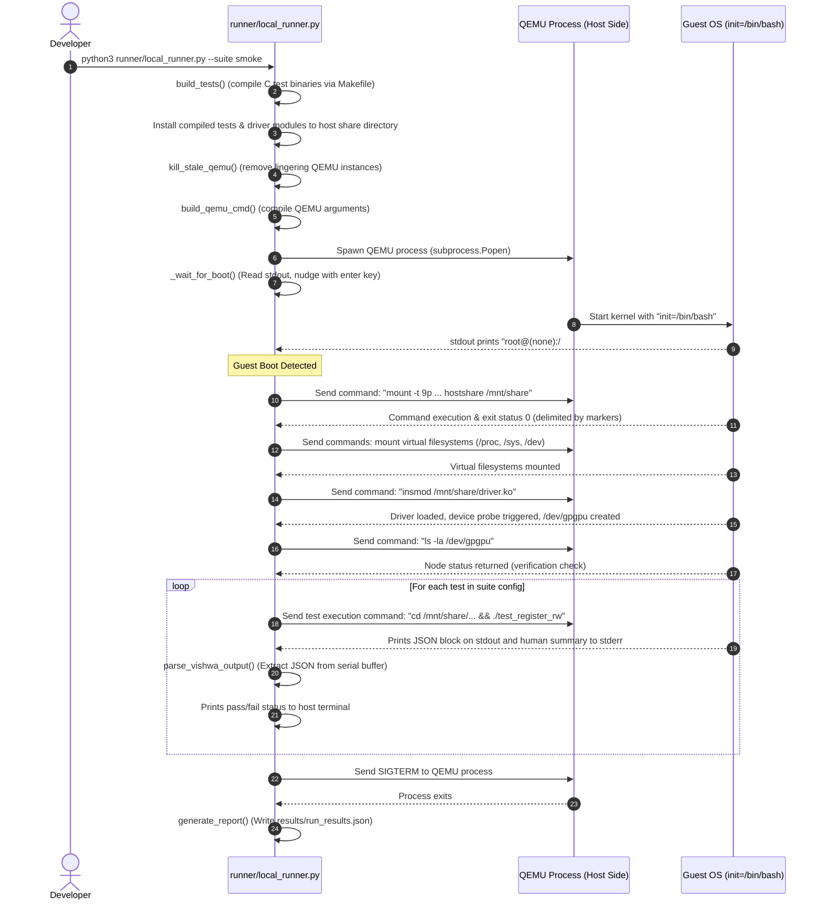

# Device Validation Framework (DVF) — Flow & Execution Documentation

This document provides a highly detailed, module-by-module, file-by-file, and function-by-function explanation of the execution flow in the **Device Validation Framework (DVF)**. 

DVF supports two primary execution workflows:
1. **Production Orchestrated Workflow** (using the Go-based control plane, QEMU VM Manager, host-to-guest Virtio-Serial communications, and the Python Guest Agent).
2. **Local developer Workflow** (using the `runner/local_runner.py` script communicating via an interactive serial console).

---

## 1. System Components & Module Directory Structure

```
driver-validation-suite/
├── DVF_FLOW_DOCUMENTATION.md      # This exhaustive documentation file
├── README.md                      # High-level architecture overview
├── docker-compose.yml             # Local dev environment (PostgreSQL & Redis)
├── configs/                       # Global orchestration configurations
│   ├── global_config.json         # Host/Server/QEMU configuration overrides
│   └── device_registry.json       # Registered PCI devices & test suite targets
├── go-orchestrator/               # Production Go-based control plane
│   ├── cmd/orchestrator/          # Main orchestrator daemon entry point
│   │   └── main.go
│   ├── internal/
│   │   ├── api/                   # Ingress gRPC and REST Gateway servers
│   │   ├── cluster/               # Node heartbeats and multi-node clusters
│   │   ├── config/                # Configuration parsing structs & loaders
│   │   ├── core/                  # Core scheduler, execution engine, DAG workflow
│   │   ├── storage/               # PostgreSQL & In-Memory persistence layers
│   │   ├── telemetry/             # Redis Stream event bus
│   │   └── vm/                    # QEMU VM Manager & host-side VirtioSerialHub
│   └── proto/                     # Protocol Buffer API contracts
├── python-agent/                  # Pure Python 3 Guest Agent (runs inside VMs)
│   └── agent/
│       ├── __init__.py
│       └── __main__.py            # Virtio-serial loop and command runner
├── runner/                        # Local Python-based developer runner (PoC)
│   ├── config.yaml                # Local runner configuration
│   └── local_runner.py            # Serial-console driven QEMU controller
├── driver-source/                 # Kernel space device drivers under validation
│   ├── gpgpu_driver/              # CDAC GPGPU PCIe driver (simulated device)
│   │   └── gpgpu_driver.c
│   └── fpga_driver/               # Custom FPGA PCIe driver (physical / hybrid)
│       └── fpga_driver.c
├── test-suites/                   # Declarative test suite DAG files (JSON)
│   ├── smoke/suite.json
│   ├── regression/suite.json
│   └── stress/suite.json
└── c-test-binaries/               # C validation test suites (run inside Guest)
    ├── common/                    # Custom lightweight C test framework
    │   ├── test_framework.h
    │   └── test_framework.c
    └── read_write/, concurrency/, error_injection/, data_integrity/, stress_performance/
```

---

## 2. Production Orchestrated Flow (Go Control Plane + Guest Agent)

The production orchestrated workflow uses a central Go daemon to coordinate VM provisioning, host-to-guest communication via low-latency Virtio-Serial sockets, topological test suite evaluation, and results gathering.

### 2.1 Complete Flow Diagram (Mermaid Sequence)



---

## 3. Local Developer Flow (Interactive Serial Console)

The local developer flow provides a direct, minimal-dependency workflow where a Python script on the host controls QEMU directly. Instead of a background daemon and Virtio-Serial messages, it interacts with QEMU using an interactive serial terminal (ttyS0 redirected to stdin/stdout).

### 3.1 Complete Flow Diagram (Mermaid Sequence)



---

## 4. Comprehensive File, Module & Function Matrix

The following table documents every major file, function, and module in the repository. It details what the code does and the exact phase of the workflow in which it gets executed.

| Directory / Module | File Path | Class / Struct / Function | Execution Stage / Trigger | Detailed Action / Explanation |
| :--- | :--- | :--- | :--- | :--- |
| **Go Orchestrator: Command Entry** | `go-orchestrator/cmd/orchestrator/main.go` | `main()` | Daemon startup | Configures resources, instantiates channels, binds all components (gRPC, REST, VM Manager, Engine), and listens for shutdown signals. |
| | | `loggingInterceptor()` | gRPC Request | Unary interceptor; logs every incoming remote gRPC call for audit trails. |
| | | `vmManagerAdapter.StartVM()` | VM Provisioning | Adapts VM Manager `StartVM` to the engine interface and attaches the VirtioSerial socket connection. |
| **Go Orchestrator: Configuration** | `go-orchestrator/internal/config/types.go` | `GlobalConfig`, `DeviceRegistry`, `DeviceEntry` | Configuration Loading | Defines JSON deserialization schemas for host environments, QEMU paths, resource limits, and PCI device manifests. |
| | `go-orchestrator/internal/config/loader.go` | `Load()`, `LoadDeviceRegistry()` | Daemon startup | Reads configuration folders (`configs/`), performs file reading, and returns initial runtime config structs. |
| **Go Orchestrator: API Handlers** | `go-orchestrator/internal/api/grpc_server.go` | `SubmitTestRun()` | Client submission | Receives gRPC test execution requests, generates a UUID, updates database, and submits to the scheduler. |
| | `go-orchestrator/internal/api/rest_gateway.go` | `RESTGateway` | Daemon startup / REST Requests | Proxies incoming HTTP REST requests to equivalent inner gRPC handler methods. Configures health probes (`/healthz`, `/readyz`). |
| | `go-orchestrator/internal/api/agent_server.go` | `RegisterAgent()` | Remote agent registration | Provides fallback API surface for guest agents connecting via gRPC instead of virtio-serial. |
| **Go Orchestrator: Storage Backend** | `go-orchestrator/internal/storage/store.go` | `Store`, `VMStore`, `TestRunStore` | Persistence actions | Interfaces defining standard query methods for database rows. |
| | `go-orchestrator/internal/storage/memory.go` | `MemoryStore` | Development fallback | Implements in-memory database maps with local mutex locking (no external DB needed). |
| | `go-orchestrator/internal/storage/postgres.go` | `PostgresStore` | Production storage | Implements active database storage backend. Manages connection pooling, SQL execution, schema tables, and migrations. |
| **Go Orchestrator: Telemetry & Tracing** | `go-orchestrator/internal/telemetry/event_bus.go` | `NewEventBus()`, `Publish()` | Event publication | Emits real-time state change events (e.g. `VMCreated`, `DriverLoaded`, `TestRunCompleted`) using Redis Streams. |
| | `go-orchestrator/internal/observability/audit.go` | `AuditLogger` | Event logging | Outputs JSON-formatted security audit logs for test cancellations, completions, and VM events. |
| | `go-orchestrator/internal/observability/tracer.go` | `InitTracer()` | Span tracking | Configures OpenTelemetry Tracer provider linking spans to trace client test requests across hosts and guests. |
| **Go Orchestrator: Core Engine** | `go-orchestrator/internal/core/scheduler.go` | `Scheduler.Enqueue()`, `Next()`, `Release()` | Test scheduling | Maintains a thread-safe slice queue of test runs, enforces concurrency boundaries, and blocks/unblocks execution loops. |
| | `go-orchestrator/internal/core/allocator.go` | `ResourceAllocator.TryAcquire()`, `Release()` | Resource Check | Prevents host over-subscription by validating available host CPU cores and memory limits before launching VMs. |
| | `go-orchestrator/internal/core/state_manager.go` | `RecoverState()` | Startup crash recovery | Queries store on startup for unfinished (e.g., `RUNNING`, `QUEUED`) test runs and cleans up orphaned VM resources. |
| | `go-orchestrator/internal/core/agent_state.go` | `AgentCoordinator.RegisterVM()`, `SendCommand()` | Host-guest coordination | Manages the synchronous command execution flow (waiters map, cmd/result channels) between the engine and VMs. |
| | `go-orchestrator/internal/core/workflow.go` | `NewWorkflow()`, `Ready()`, `Advance()` | Workflow DAG evaluation | Generates and manages the DAG dependency tree of test steps. Performs Kahn's topological sort and handles cycle detection. |
| | `go-orchestrator/internal/core/execution_engine.go` | `worker()` | Core engine background loop | Continuous worker goroutine pulling pending jobs from the scheduler. |
| | | `executeTestRun()` | Single run execution | Controls the complete VM execution lifespan (status updates, VM spin-up, agent handshakes, driver loading, test trigger, VM teardown). |
| | | `runWorkflow()` | Test step driving | Evaluates test suite DAG steps, triggers `SendCommand` actions, processes retries, and captures results. |
| | | `processResultsForStep()` | Result collection | Decodes raw JSON output logs from guest tests and saves individual tests results (`TestResult`) to storage. |
| **Go Orchestrator: Virtualization** | `go-orchestrator/internal/vm/manager.go` | `BuildQEMUArgs()` | VM creation | Translates config options (rootfs, overlay, kernel, QMP ports, shared folders, devices) into raw command arguments. |
| | | `StartVM()` | VM booting | Allocates a QCOW2 overlay using `qemu-img`, spawns the QEMU process group, and establishes a QMP connection. |
| | | `StopVM()`, `DestroyVM()` | VM teardown | Gracefully triggers ACPI powerdown via QMP or falls back to SIGTERM/SIGKILL. Deletes overlay disks. |
| | `go-orchestrator/internal/vm/qmp_client.go` | `QMPClient.Connect()`, `Execute()` | QEMU controller | Handles JSON-RPC command structures sent over local QMP sockets (e.g., query status, system powerdowns). |
| | `go-orchestrator/internal/vm/virtio_serial.go` | `serveVM()` | Host socket bridge | Dial-connects to Unix socket `/tmp/dvf/agent/<vmID>.sock` and decodes incoming JSON streams (registration, heartbeats, logs, results). |
| | | `commandPump()` | Host-to-guest writer | Pulls commands from the Agent Coordinator and serializes them as JSON over the guest socket connection. |
| **Python Guest Agent** | `python-agent/agent/__main__.py` | `mount_guest_filesystems()` | Agent startup | Mounts procfs, sysfs, devtmpfs, and the host shared folder using 9p filesystem. |
| | | `parse_vishwa_output()` | Test result parsing | Extracted text analyzer implementing 4-strategies to pull JSON logs, summaries, or sentinel PASSED/FAILED statements. |
| | | `DVFAgent.run()` | Agent loop initiation | Opens the `/dev/virtio-ports/dvf.agent.0` device port using raw OS file descriptors. |
| | | `DVFAgent.register()` | Registration handshake | Sends agent environment details to the host and waits for registration ACK before enabling loops. |
| | | `DVFAgent.execute()` | Command router | Dispatches incoming JSON commands to appropriate helper handlers and returns the formatted response. |
| | | `_handle_load_driver()` | Driver installation | Invokes `insmod <ko_path>` to load the kernel driver, capturing any `dmesg` output on failures. |
| | | `_handle_verify_device()` | Device validation | Sanity checks the driver binding status by checking device files in `/dev` (e.g., `/dev/gpgpu`). |
| | | `_handle_start_test()` | Test execution | Runs test binaries via `subprocess.Popen`, capturing and streaming stdout/stderr back to the host event logs. |
| **Local Runner (PoC)** | `runner/local_runner.py` | `build_tests()` | Local test startup | Triggers Makefile compilation of C validation test binaries and moves output files to shared QEMU folders. |
| | | `QEMUInstance.start()` | Local VM booting | Spawns QEMU redirection processes, capturing stdin/stdout pipelines to emulate interactive serial terminals. |
| | | `QEMUInstance._wait_for_boot()` | Guest boot verification | Monitors stdout streams for shell prompt signatures (`root@(none):/#`) indicating boot completion. |
| | | `QEMUInstance.run_command()` | Console execution | Wraps guest terminal commands with unique echo markers and parses outputs based on matching return codes. |
| | | `run_tests()` | Test execution loop | Drives mounts, insmods, test executions, and output processing directly through serial console commands. |
| **C Validation Tests** | `c-test-binaries/common/test_framework.c` | `test_install_signal_handlers()` | C test setup | Configures sigaction structures trapping critical hardware violations (SIGSEGV, SIGBUS, SIGFPE, SIGABRT). |
| | | `test_suite_print_json()` | C test finalization | Serializes test case results, metrics, and execution times into a JSON object printed directly to stdout. |
| | `c-test-binaries/read_write/test_register_rw.c` | `test_register_rw()` | Test run | Executes register read/write verification cycles against mapped MMIO space. |
| **Kernel Modules** | `driver-source/gpgpu_driver/gpgpu_driver.c` | `gpgpu_probe()` | Kernel module load | PCI binding function triggered by `insmod`. Maps MMIO BAR regions, registers character device `/dev/gpgpu`. |
| | | `dev_read()`, `dev_write()` | Driver character device I/O | Decodes register read/write commands from user-space test binaries and routes accesses to physical MMIO space. |
| | | `gpgpu_remove()` | Kernel module unload | Unmaps MMIO resources, destroys class objects, and unregisters the character device. |

---

## 5. Detailed Step-by-Step Function Call Trees

### 5.1 Production gRPC/REST Test Run Submission & Execution Loop

When a user submits a test run, the execution flows dynamically through the following function calls across Go modules:

```
[HTTP CLIENT / gRPC CLIENT]
  │
  ▼
api.RESTGateway.Register() / api.GRPCServer.SubmitTestRun()
  │
  ▼
core.ExecutionEngine.SubmitTestRun(run)
  │
  ▼
  ├─► telemetry.EventBus.Publish(EventTestRunSubmitted)
  └─► core.Scheduler.Enqueue(run)
        │
        ▼ (Unblocks worker thread)
core.ExecutionEngine.worker()
  │
  ▼ (Parallel Go Routine)
core.ExecutionEngine.executeTestRun(ctx, run)
  │
  ├─► storage.Store.UpdateTestRunStatus(RUNNING)
  ├─► config.DeviceRegistry.FindDevice(deviceID)
  ├─► core.ExecutionEngine.loadTestSuite(suiteID)
  ├─► core.ResourceAllocator.TryAcquire(Allocation)  <-- (If host capacity is met, defer & re-enqueue)
  │
  ├─► vm.VMManager.CreateVM(ctx, device)
  │     └─► storage.Store.SaveVM(vmInstance)
  │
  ├─► core.AgentCoordinator.RegisterVM(vmID)
  │
  ├─► vm.VMManager.StartVM(ctx, vmID)
  │     ├─► OS Command: qemu-img create -f qcow2 -b rootfs.ext4 /tmp/dvf/overlays/vm-x.qcow2
  │     ├─► OS Command: qemu-system-x86-64 <BuildQEMUArgs> (Starts process group)
  │     ├─► storage.Store.UpdateVMStatus(BOOTING)
  │     └─► vm.QMPClient.Connect() & QueryStatus()
  │
  ├─► vm.VirtioSerialHub.ConnectVM(vmID)
  │     └─► (Go routine) vm.VirtioSerialHub.serveVM(vmID)
  │           └─► net.Dial("unix", "/tmp/dvf/agent/vm-x.sock") (retries until connected)
  │
  └─► core.AgentCoordinator.WaitForAgent(vmID) (blocks engine thread)
```

### 5.2 Guest Agent Handshake & Loop Initialization

Inside the QEMU Virtual Machine:

```
[Systemd / dvf-init]
  │
  ▼
python-agent/agent/__main__.py (main)
  │
  ├─► mount_guest_filesystems("/mnt/share")  <-- (mounts 9p host share)
  ├─► Scan `/dev/virtio-ports/dvf.agent.0` (udev path) or `/dev/vport*`
  │
  ▼
python-agent/agent/__main__.py (DVFAgent.run)
  │
  ├─► os.open("/dev/virtio-ports/dvf.agent.0", O_RDWR | O_NOCTTY)
  ├─► DVFAgent.register()
  │     └─► sends JSON: {"msg":"register", "vm_id":"vm-x", ...}
  │
  ▼ (Host socket receives register message)
vm.VirtioSerialHub.serveVM()
  ├─► core.AgentCoordinator.NotifyAgentReady(vmID, agentID) <-- (Unblocks WaitForAgent in engine)
  ├─► writes ACK: {"msg":"ack", "agent_id":"agent-vm-x"}
  └─► (Go routine) vm.VirtioSerialHub.commandPump(vmID)
        │
        ▼ (Guest Agent receives ACK)
DVFAgent.register() stores agent_id
  │
  ├─► (Thread) DVFAgent.heartbeat_loop() (Sends periodic heartbeats)
  └─► DVFAgent.command_loop() (Blocks reading commands from virtio port fd)
```

### 5.3 Test Execution, Telemetry, and Teardown Flow

With both control plane and agent ready, the workflow execution and teardown follow:

```
core.ExecutionEngine.executeTestRun(ctx, run)  <-- (WaitForAgent unblocked)
  │
  ├─► core.AgentCoordinator.SendCommand(load_driver)
  │     ├─► Enqueues load_driver command to vm.agentState.commands channel
  │     ├─► vm.VirtioSerialHub.commandPump writes: {"msg":"command","cmd":"load_driver", ...}
  │     │     │
  │     │     ▼ (Guest Agent reads command)
  │     ├─► DVFAgent.execute() -> _handle_load_driver()
  │     │     ├─► runs: insmod /mnt/share/gpgpu_pcie_ep_driver.ko
  │     │     └─► writes result: {"msg":"result","status":"passed", ...}
  │     │           │
  │     │           ▼ (Host receives result)
  │     └─► core.AgentCoordinator.DeliverResult() <-- (Unblocks SendCommand in engine)
  │
  ├─► core.ExecutionEngine.runWorkflow(ctx, run, device, vmInstance, suite)
  │     ├─► core.NewWorkflow(suite.Steps) (builds DAG graph)
  │     ├─► Loops Ready() steps in topological sort
  │     │     ▼
  │     ├─► core.AgentCoordinator.SendCommand(start_test)
  │     │     ├─► Host writes command: {"msg":"command","cmd":"start_test","params":{"binary":"..."}}
  │     │     │     │
  │     │     │     ▼ (Guest Agent reads command)
  │     │     ├─► DVFAgent.execute() -> _handle_start_test()
  │     │     │     ├─► runs: /mnt/share/dvf_tests/read_write/test_register_rw
  │     │     │     ├─► (Threads) Drains stdout/stderr and streams logs via {"msg":"log", ...}
  │     │     │     ├─► Wait for process exit status
  │     │     │     ├─► DVFAgent.parse_vishwa_output(raw_output)
  │     │     │     └─► writes result JSON string: {"msg":"result","status":"passed","output":"{...}"}
  │     │     │           │
  │     │     │           ▼ (Host receives result)
  │     │     ├─► core.ExecutionEngine.processResultsForStep(stepID, agentResult)
  │     │     │     └─► storage.Store.SaveTestResult(testResult)
  │     │     └─► core.Workflow.Advance(stepID, status)
  │     └─► Repeats loop until DAG is complete
  │
  ├─► Defer block executes StopAndDestroyVM()
  │     ├─► vm.VirtioSerialHub.DisconnectVM(vmID) (Closes unix connections & halts commandPump)
  │     ├─► vm.VMManager.StopVM(vmID)
  │     │     ├─► vm.QMPClient.Execute(system_powerdown)
  │     │     ├─► Wait 10s for process exit (or falls back to SIGTERM / SIGKILL)
  │     │     └─► storage.Store.UpdateVMStatus(STOPPED)
  │     ├─► vm.VMManager.DestroyVM(vmID)
  │     │     ├─► Removes socket files and deletes /tmp/dvf/overlays/vm-x.qcow2
  │     │     └─► storage.Store.UpdateVMStatus(DESTROYED)
  │     └─► core.AgentCoordinator.UnregisterVM(vmID)
  │
  ├─► core.ResourceAllocator.Release(Allocation)
  └─► storage.Store.UpdateTestRunStatus(PASSED/FAILED)
```

---

## 6. Automated CI/CD Execution Flow (Git GitLab CI Pipeline)

The DVF testing framework is fully integrated into a GitLab CI/CD pipeline to automate validation runs on every commit/push. 

### 6.1 Comprehensive Pipeline Call Flow

```
1. Developer pushes code to repository
   │
   ├──► [Stage: build]
   │     ├─► build-orchestrator: Compiles Go Orchestrator binary to go-orchestrator/orchestrator
   │     │     └─► Saves binary as job artifact
   │     └─► build-test-binaries: Compiles C test binaries using Make
   │           └─► Saves c-test-binaries/ folder as job artifact
   │
   ├──► [Stage: deploy]
   │     └─► deploy-vishwa: Gathers all artifacts and builds drivers:
   │           ├─► Builds GPGPU kernel driver (gpgpu_pcie_ep_driver.ko)
   │           ├─► Builds Vishwa runtime and tests
   │           ├─► Pre-builds Python venv with grpcio/protobuf dependencies
   │           └─► Copies all driver, agent, and test binaries to the QEMU 9p share (/home/kartheekbudime/qemu-rootfs/share)
   │
   └──► [Stage: test]
         └─► orchestrate-validation:
               ├─► Installs curl and git
               ├─► Starts go-orchestrator in background:
               │     ./go-orchestrator/orchestrator --config go-orchestrator/configs --storage memory &
               ├─► Polls REST API healthcheck http://localhost:9080/healthz until healthy (up to 30s)
               ├─► Runs scripts/ci_impact_analyzer.py (without --dry-run):
               │     ├─► Performs git diff against master branch to find changed files
               │     ├─► Parses test-suites/**/*.json sidecar dependency files
               │     ├─► Resolves impacted test suite targets via Kahn's DAG algorithm
               │     ├─► Sends POST /api/v1/test-runs requests to local REST gateway
               │     │     │
               │     │     ▼ (Orchestrator receives request)
               │     │   - VMManager starts VM instance with GPGPU device configuration
               │     │   - Guest Agent registers over virtio-serial socket (/dev/virtio-ports/dvf.agent.0)
               │     │   - Agent mounts 9p share, loads driver, and executes tests in topological order
               │     │   - Agent returns results/logs; VM is torn down cleanly
               │     │     │
               │     │     ▼ (Impact analyzer polls results)
               │     └─► Exits with exit status 0 (all passed) or 1 (failures)
               └─► Executes cleanup trap: kills background orchestrator daemon PID, preventing port locks

