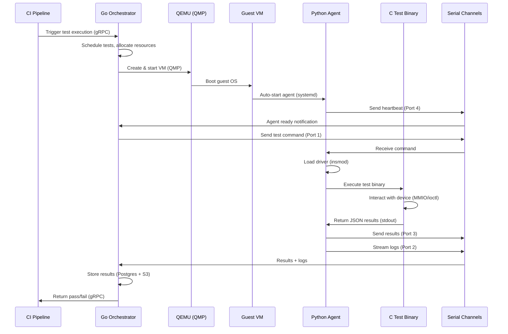

# End-to-End Device Validation Framework — Implementation Plan

> Derived from the complete architecture blueprint. This plan covers every component from CI pipeline down to guest kernel-level validation.

## Current State

The workspace has a **directory skeleton only** — every file is empty:

```
driver-validation-suite/
├── .gitlab-ci.yml                          # empty
├── README.md                               # empty
├── driver-source/
│   ├── ai_driver/                          # empty
│   └── gpu_driver/                         # empty
├── framework-orchestrator/
│   ├── orchestrator.py                     # empty
│   ├── requirements.txt                    # empty
│   ├── configs/
│   │   ├── device_registry.json            # empty
│   │   └── global_congif.json              # empty (typo: "congif")
│   ├── modules/
│   │   ├── __init__.py                     # empty
│   │   ├── build_manager.py                # empty
│   │   ├── grpc_server.py                  # empty
│   │   ├── qmp_client.py                   # empty
│   │   └── vm_manager.py                   # empty
│   └── proto/
│       └── telemetry.proto                 # empty
├── qemu-accelerator-models/
│   └── meson.build                         # empty
└── test-suites/                            # empty
```

> [!IMPORTANT]
> The blueprint specifies the **Go Orchestrator (Control Plane)** in **Go** and the **Python Automation Agent** in **Python**. The existing `framework-orchestrator/` Python skeleton will be **deprecated and replaced** with a proper Go module under `go-orchestrator/`.

---

## User Review Required

> [!NOTE]
> **Language Decision: RESOLVED**
> - **Go Orchestrator** (Control Plane) — all of Box 2 in the blueprint
> - **Python Agent** (Inside Guest VM) — all of Box 4 in the blueprint
> - The existing `framework-orchestrator/` Python skeleton will be **removed** and replaced with `go-orchestrator/`

> [!IMPORTANT]
> **Scope Priority**: This is a massive system. We should pick a **vertical slice** to implement first that proves the end-to-end flow. I recommend the following order:
> 1. **Phase 1**: Foundation (configs, directory structure, shared types)
> 2. **Phase 2**: VM Infrastructure (QMP client, VM Manager — the core capability)
> 3. **Phase 3**: Serial Channels (guest ↔ host communication)
> 4. **Phase 4**: Python Automation Agent (inside guest VM)
> 5. **Phase 5**: Guest OS / C Test Binaries
> 6. **Phase 6**: Orchestration Core (scheduler, execution engine, state)
> 7. **Phase 7**: API & Ingress Layer (gRPC server, auth)
> 8. **Phase 8**: Telemetry, Observability & CI

---

## Open Questions

> [!IMPORTANT]
> Please answer these before we begin — they directly impact implementation:

1. **Which QEMU devices are we validating first?** The `driver-source/` has `ai_driver/` and `gpu_driver/` — which one should the first vertical slice target?
2. **Do you have a base QEMU VM image already?** (e.g., a pre-built Linux `.qcow2` image with KVM support) Or should we create one as part of Phase 2?
3. **What guest OS?** The blueprint mentions "Linux distribution (Ubuntu/CentOS/Rocky/etc.)" — which distro and version?
4. **Infrastructure**: Single-node development setup, or multi-node from the start?
5. **Storage backend**: Local disk only for now, or do you need Ceph/MinIO/S3 from Phase 1?
6. **Database**: PostgreSQL + Redis for metadata/state, InfluxDB/Prometheus for time-series — containerized (Docker Compose) or native installs?
7. **The QEMU accelerator models** (`qemu-accelerator-models/meson.build`) — do you have existing QEMU device model C source code, or are we building new ones? (I see from conversation history you've worked on custom QEMU PCI devices before)
8. **C Test Binaries**: Do you have existing test binaries, or do we need to create the test framework (read/write ops, interrupt handling, error injection, stress/perf, power management, concurrency, data integrity)?

---

## Proposed Directory Structure

Based on the blueprint, the full project structure should look like this:

```
driver-validation-suite/
├── .gitlab-ci.yml
├── .gitignore
├── README.md
├── docker-compose.yml                         # Local dev infrastructure
├── Makefile                                   # Top-level build orchestration
│
├── go-orchestrator/                           # [NEW] Go Control Plane (Box 2)
│   ├── go.mod
│   ├── go.sum
│   ├── cmd/
│   │   └── orchestrator/
│   │       └── main.go                        # Entry point
│   ├── internal/
│   │   ├── api/                               # 2.1 API & Ingress Layer
│   │   │   ├── grpc_server.go
│   │   │   ├── auth.go
│   │   │   ├── rate_limiter.go
│   │   │   └── request_validator.go
│   │   ├── core/                              # 2.2 Orchestration Core
│   │   │   ├── scheduler.go
│   │   │   ├── execution_engine.go
│   │   │   ├── state_manager.go
│   │   │   ├── workflow_manager.go
│   │   │   └── versioning.go
│   │   ├── config/                            # 2.3 Configuration & Data
│   │   │   ├── loader.go
│   │   │   ├── validator.go
│   │   │   └── template_manager.go
│   │   ├── vm/                                # 2.4 Resource & VM Management
│   │   │   ├── manager.go
│   │   │   ├── qmp_client.go
│   │   │   ├── resource_allocator.go
│   │   │   └── infra_manager.go
│   │   ├── telemetry/                         # 2.5 Telemetry & Messaging
│   │   │   ├── grpc_telemetry_server.go
│   │   │   ├── event_bus.go
│   │   │   ├── metrics_aggregator.go
│   │   │   └── alert_manager.go
│   │   ├── storage/                           # 2.6 Data Storage
│   │   │   ├── postgres.go                    # Persistent metadata (runs, results, audit)
│   │   │   ├── redis.go                       # Real-time state, event bus, caching
│   │   │   ├── timeseries.go
│   │   │   ├── object_store.go
│   │   │   └── log_store.go
│   │   └── observability/                     # 2.7 Observability & Operations
│   │       ├── logger.go                      # Zap
│   │       ├── tracer.go                      # OpenTelemetry
│   │       ├── health.go
│   │       └── audit.go
│   ├── proto/                                 # gRPC service definitions
│   │   ├── orchestrator.proto
│   │   ├── telemetry.proto
│   │   └── agent.proto
│   └── configs/
│       ├── global_config.json
│       ├── device_registry.json
│       └── test_policies/
│
├── python-agent/                              # [NEW] Box 4: Python Automation Agent
│   ├── requirements.txt
│   ├── agent/
│   │   ├── __init__.py
│   │   ├── core.py                            # 4.1 Agent Core
│   │   ├── test_executor.py                   # 4.2 Test Executor
│   │   ├── guest_interaction.py               # 4.3 Guest Interaction
│   │   ├── serial_manager.py                  # 4.4 Serial Manager
│   │   └── telemetry_client.py                # 4.5 Telemetry Client
│   └── tests/
│
├── serial-channels/                           # [NEW] Box 5: Virtual Serial Channels
│   ├── protocol/
│   │   ├── control.py                         # Port 1: Control Channel
│   │   ├── log.py                             # Port 2: Log Channel
│   │   ├── result.py                          # Port 3: Result Channel
│   │   └── heartbeat.py                       # Port 4: Heartbeat Channel
│   └── host/                                  # Host-side serial handlers (Go)
│       ├── serial_listener.go
│       └── channel_mux.go
│
├── guest-os/                                  # [NEW] Box 6: Guest OS Layer
│   ├── images/                                # VM image build scripts
│   │   ├── Makefile
│   │   └── kickstart/                         # Automated OS install configs
│   ├── drivers/                               # 6.2 Device Drivers to load
│   └── scripts/                               # 6.1 OS Environment setup
│
├── c-test-binaries/                           # [NEW] Box 6.3: C Test Binaries
│   ├── CMakeLists.txt
│   ├── common/
│   │   ├── test_framework.h                   # Shared test macros/helpers
│   │   └── device_io.h                        # MMIO/IOCTL helpers
│   ├── read_write/
│   ├── interrupt_handling/
│   ├── error_injection/
│   ├── stress_performance/
│   ├── power_management/
│   ├── concurrency/
│   └── data_integrity/
│
├── driver-source/                             # Existing — device driver source
│   ├── ai_driver/
│   └── gpu_driver/
│
├── qemu-accelerator-models/                   # Existing — custom QEMU device models
│   ├── meson.build
│   └── hw/
│       └── misc/
│
├── test-suites/                               # Existing — test suite definitions (JSON/YAML)
│   ├── smoke/
│   ├── regression/
│   └── stress/
│
└── framework-orchestrator/                    # DEPRECATED — replaced by go-orchestrator/
```

> [!NOTE]
> The existing `framework-orchestrator/` Python skeleton is **deprecated** and will be replaced by `go-orchestrator/`. The Python files (`orchestrator.py`, `modules/`) will be removed once the Go orchestrator is in place.

---

## Phase 1: Foundation & Configuration (Days 1–2)

### Goals
- Establish directory structure, build system, shared types, and configuration schemas
- Set up development infrastructure (Docker Compose for Postgres, MinIO, etc.)

---

### Project Root

#### [NEW] [Makefile](file:///home/kartheekbudime/driver-validation-suite/Makefile)
Top-level Makefile with targets: `build`, `test`, `lint`, `run-dev`, `vm-image`, `proto-gen`

#### [NEW] [docker-compose.yml](file:///home/kartheekbudime/driver-validation-suite/docker-compose.yml)
Development infrastructure: PostgreSQL, **Redis**, MinIO (S3-compatible object storage), Prometheus, Grafana

#### [MODIFY] [.gitignore](file:///home/kartheekbudime/driver-validation-suite/.gitignore)
Add standard Go, Python, C, QEMU build artifacts, VM images, etc.

#### [MODIFY] [README.md](file:///home/kartheekbudime/driver-validation-suite/README.md)
Project overview, architecture diagram reference, quick-start guide

---

### Configuration & Data (Box 2.3)

#### [NEW] [global_config.json](file:///home/kartheekbudime/driver-validation-suite/go-orchestrator/configs/global_config.json)
- Master configuration schema: compute resources, network settings, storage paths, telemetry endpoints
- JSON Schema validation support

#### [NEW] [device_registry.json](file:///home/kartheekbudime/driver-validation-suite/go-orchestrator/configs/device_registry.json)
- Registry of all device types (ai_driver, gpu_driver), their QEMU model names, PCI IDs, driver paths, test suites

---

## Phase 2: VM Infrastructure & QMP Client (Days 3–7)

### Goals
- QEMU VM lifecycle management (create, start, stop, destroy, snapshot)
- QMP protocol client for programmatic VM control
- Resource allocation (CPU, memory, disk, network)
- Virtual serial channel setup (4 virtio-serial ports per VM)

---

### Resource & VM Management (Box 2.4)

#### [NEW] [manager.go](file:///home/kartheekbudime/driver-validation-suite/go-orchestrator/internal/vm/manager.go)
- `CreateVM(config VMConfig) → VM` — Assembles QEMU command line with:
  - CPU/memory allocation
  - Disk images (backing + overlay)
  - Network (tap/bridge or user-mode)
  - 4 × virtio-serial ports (control, log, result, heartbeat)
  - Device under test (PCI passthrough or custom QEMU device)
  - QMP socket path
- `StartVM(vmID) → error`
- `StopVM(vmID) → error` (graceful via QMP `system_powerdown`, then force `quit`)
- `DestroyVM(vmID) → error` (cleanup sockets, overlays, PIDs)
- `SnapshotVM(vmID, name) → error`
- `ListVMs() → []VMStatus`

#### [NEW] [qmp_client.go](file:///home/kartheekbudime/driver-validation-suite/go-orchestrator/internal/vm/qmp_client.go)
- QMP (QEMU Machine Protocol) client over Unix socket
- Capabilities negotiation on connect
- Execute commands: `query-status`, `stop`, `cont`, `quit`, `system_powerdown`, `device_add`, `device_del`, `human-monitor-command`
- Event listener (async events from QEMU)
- Connection lifecycle (connect, reconnect, timeout)

#### [NEW] [resource_allocator.go](file:///home/kartheekbudime/driver-validation-suite/go-orchestrator/internal/vm/resource_allocator.go)
- Track available host resources (CPUs, RAM, disk, network interfaces)
- Allocate/release resources per VM
- Prevent over-subscription
- NUMA-aware allocation (optional)

#### [NEW] [infra_manager.go](file:///home/kartheekbudime/driver-validation-suite/go-orchestrator/internal/vm/infra_manager.go)
- Manage compute nodes, storage pools, and network infrastructure
- Node health monitoring
- Storage provisioning (local disk, NAS/SAN, Ceph)

---

## Phase 3: Virtual Serial Channels (Days 8–10)

### Goals
- Implement the 4-port virtual serial communication protocol between host and guest
- This is the backbone of all guest ↔ host interaction

---

### Serial Channel Protocol (Box 5)

Each channel uses a Unix domain socket on the host side, connected to a `/dev/virtioN` device inside the guest.

#### [NEW] Protocol Definition (shared between host Go and guest Python)
- **Port 1 — Control Channel**: Host → Guest. Commands: `start_test`, `stop_test`, `load_config`, `deploy_binary`, `shutdown`. JSON-framed messages with sequence IDs.
- **Port 2 — Log Channel**: Guest → Host. Structured log streaming in real-time. JSON lines format with severity, timestamp, source, message.
- **Port 3 — Result Channel**: Guest → Host. Test results, metrics, pass/fail status. JSON messages with test ID, status, duration, metrics dict.
- **Port 4 — Heartbeat Channel**: Bidirectional. Periodic heartbeat (every 1–5s). Host detects guest agent health. Contains agent state, resource utilization, active test count.

#### [NEW] Host-side Serial Handlers (Go)
- `serial_listener.go` — Listens on Unix sockets for each VM's 4 channels
- `channel_mux.go` — Multiplexes/demultiplexes messages, routes to appropriate handlers
- Reconnection logic, buffering, backpressure

#### [NEW] Guest-side Serial Manager (Python)
- `serial_manager.py` — Opens `/dev/vportNpM` devices, manages read/write threads per channel
- Message framing, serialization, error handling

---

## Phase 4: Python Automation Agent (Days 11–15)

### Goals
- Guest-side agent that receives commands, deploys test binaries, executes tests, and reports results

---

### Python Agent (Box 4)

#### [NEW] [core.py](file:///home/kartheekbudime/driver-validation-suite/python-agent/agent/core.py)
- Agent lifecycle: startup → register → wait for commands → execute → report → idle
- Starts on VM boot (systemd service)
- Reads control channel for commands
- Maintains agent state machine: `INITIALIZING → READY → EXECUTING → REPORTING → READY`

#### [NEW] [test_executor.py](file:///home/kartheekbudime/driver-validation-suite/python-agent/agent/test_executor.py)
- Receives test execution commands
- Deploys C test binaries (received via file transfer or pre-loaded in image)
- `subprocess.Popen` for running C binaries with timeout, resource limits
- Captures stdout/stderr, exit codes
- JSON parsing of test output (structured results from C binaries)

#### [NEW] [guest_interaction.py](file:///home/kartheekbudime/driver-validation-suite/python-agent/agent/guest_interaction.py)
- Interacts with OS: `dmesg`, file I/O, `sysfs` reads, `ioctl` calls
- Loads/unloads kernel modules (`insmod`, `rmmod`, `modprobe`)
- Device file operations (`/dev/...`)
- Kernel log monitoring

#### [NEW] [serial_manager.py](file:///home/kartheekbudime/driver-validation-suite/python-agent/agent/serial_manager.py)
- Manages 4 virtio-serial ports
- Thread-per-channel with message queuing
- Heartbeat sender (periodic, non-blocking)

#### [NEW] [telemetry_client.py](file:///home/kartheekbudime/driver-validation-suite/python-agent/agent/telemetry_client.py)
- Sends telemetry (metrics, logs, traces) back to host via gRPC
- Batching, retry, and buffering for offline resilience
- Alternatively, telemetry can flow via serial channels if gRPC isn't available in guest

---

## Phase 5: Guest OS & C Test Binaries (Days 16–20)

### Goals
- VM image creation with pre-installed dependencies
- C test binary framework for kernel-level device validation

---

### Guest OS Setup (Box 6.1, 6.2)

#### [NEW] VM Image Build
- Automated image creation (Packer or kickstart/preseed)
- Base OS install + Python agent + serial port udev rules + driver compilation tools
- Pre-load kernel headers, gcc, make for in-guest driver compilation

#### [NEW] Driver Loading Scripts
- Automated `insmod`/`modprobe` for device drivers under test
- `dmesg` monitoring for driver load success/failure
- `sysfs`/`procfs` verification

---

### C Test Binary Framework (Box 6.3)

#### [NEW] [CMakeLists.txt](file:///home/kartheekbudime/driver-validation-suite/c-test-binaries/CMakeLists.txt)
- Cross-compilation support (build on host, run in guest)
- Per-test-category build targets

#### [NEW] Test Categories (from blueprint)

| Category | Description | Key Syscalls/APIs |
|---|---|---|
| **Read/Write Operations** | Basic MMIO read/write, DMA buffer ops | `mmap`, `read`, `write`, `ioctl` |
| **Interrupt Handling** | IRQ registration, MSI/MSI-X, interrupt storms | `/proc/interrupts`, `eventfd` |
| **Error Injection** | Fault injection, error recovery paths | `debugfs`, custom `ioctl` |
| **Stress / Performance** | Throughput, latency, sustained load | `clock_gettime`, threading |
| **Power Management** | Suspend/resume, runtime PM, D-states | `sysfs` PM controls |
| **Concurrency** | Multi-threaded access, race conditions | `pthread`, atomic ops |
| **Data Integrity** | CRC checks, pattern verification, corruption detect | Custom patterns |

Each binary outputs structured JSON results to stdout for the Python agent to parse.

---

## Phase 6: Orchestration Core (Days 21–27)

### Goals
- Test scheduling, execution engine, state tracking, workflow management

---

### Orchestration Core (Box 2.2)

#### [NEW] [scheduler.go](file:///home/kartheekbudime/driver-validation-suite/go-orchestrator/internal/core/scheduler.go)
- Schedules and prioritizes tests based on resources, policies, and dependencies
- Priority queue with resource-aware scheduling
- Dependency graph resolution (test A must complete before test B)

#### [NEW] [execution_engine.go](file:///home/kartheekbudime/driver-validation-suite/go-orchestrator/internal/core/execution_engine.go)
- Creates test runs: provisions VMs, assigns tests, monitors execution
- Orchestrates the full lifecycle: VM create → agent ready → deploy binary → execute → collect results → VM teardown
- Parallel execution across multiple VMs

#### [NEW] [state_manager.go](file:///home/kartheekbudime/driver-validation-suite/go-orchestrator/internal/core/state_manager.go)
- Tracks state of tests, VMs, agents, and resources in real-time
- Persists state to PostgreSQL for crash recovery
- State transitions with audit logging

#### [NEW] [workflow_manager.go](file:///home/kartheekbudime/driver-validation-suite/go-orchestrator/internal/core/workflow_manager.go)
- Manages complex test workflows and dependencies (DAG execution)
- Supports sequential, parallel, and conditional test flows

---

## Phase 7: API & Ingress + Telemetry (Days 28–33)

### Goals
- gRPC API for external consumers (CLI, Web UI, CI pipelines)
- Telemetry ingestion and storage

---

### API & Ingress Layer (Box 2.1)

#### [NEW] Proto Definitions
- `orchestrator.proto` — Service RPCs: `SubmitTestRun`, `GetTestStatus`, `ListVMs`, `GetResults`, etc.
- `telemetry.proto` — Streaming RPCs: `StreamLogs`, `StreamMetrics`, `StreamEvents`
- `agent.proto` — Agent registration and command RPCs

#### [NEW] [grpc_server.go](file:///home/kartheekbudime/driver-validation-suite/go-orchestrator/internal/api/grpc_server.go)
- High-performance gRPC server
- Interceptors for auth, logging, rate limiting, request validation

#### [NEW] [auth.go](file:///home/kartheekbudime/driver-validation-suite/go-orchestrator/internal/api/auth.go)
- RBAC-based authorization
- API key / token authentication

---

### Telemetry & Messaging (Box 2.5)

#### [NEW] Telemetry Server + Event Bus
- gRPC telemetry server receiving high-throughput streams from agents and VMs
- **Event bus backed by Redis Streams** for real-time event distribution
- Metrics aggregation into Prometheus-compatible format

### Data Storage — Dual Store Architecture (Box 2.6)

#### [NEW] [postgres.go](file:///home/kartheekbudime/driver-validation-suite/go-orchestrator/internal/storage/postgres.go)
**PostgreSQL — Persistent Metadata (Cold Data)**
- Connection pool via `pgxpool`
- Schema migrations (golang-migrate)
- Tables: `test_runs`, `test_results`, `schedules`, `devices`, `users`, `audit_logs`
- Complex queries: historical analysis, reporting, pass-rate aggregation
- ACID transactions for state machine transitions

#### [NEW] [redis.go](file:///home/kartheekbudime/driver-validation-suite/go-orchestrator/internal/storage/redis.go)
**Redis — Real-Time State (Hot Data)**
- VM state cache (`HASH vm:{id}` — instant status lookup)
- Agent heartbeats (`SET` with TTL — auto-expire = dead agent detection)
- Event bus (`Redis Streams` — real-time event pub/sub for Box 2.5)
- Rate limiting (`INCR` + `EXPIRE` — API rate limiting for Box 2.1)
- Job queue (`Sorted Set` — test scheduling priority queue with fast dequeue)
- Distributed locks (`SET NX EX` / Redlock — prevent double-scheduling)
- Config caching (`STRING` with TTL — cache device registry, global config)

---

## Phase 8: Observability, CI & Polish (Days 34–40)

### Goals
- Logging (Zap), Tracing (OpenTelemetry), Health checks, Dashboard
- CI/CD pipeline in GitLab CI
- End-to-end integration testing

---

### Observability (Box 2.7)

- Structured logging with Zap (Go) / standard logging (Python)
- Distributed tracing with OpenTelemetry across orchestrator, agents, and VMs
- Health check endpoints (liveness, readiness)
- Audit log for all state-mutating operations

### CI Environment (Box 1)

#### [MODIFY] [.gitlab-ci.yml](file:///home/kartheekbudime/driver-validation-suite/.gitlab-ci.yml)
- Stages: `lint` → `build` → `test` → `package` → `deploy`
- Build Go orchestrator, Python agent wheel, C test binaries
- Static analysis (golangci-lint, pylint, cppcheck)
- Unit tests (Go test, pytest, CTest)
- Package artifacts (container images, VM images)
- Push to artifact registry

---

## Data Flow Summary



---

## Technology Stack Summary

| Area | Technology | Justification |
|---|---|---|
| Control Plane | **Go** | High-performance orchestration, concurrency, gRPC native |
| Guest Agent | **Python** | Test automation, OS interaction, developer productivity |
| API Layer | **gRPC** | High-throughput, low-latency, streaming support |
| Configuration | **JSON** | Declarative configs, VM templates, test definitions |
| VM Control | **QEMU / QMP** | Programmatic VM lifecycle management |
| Guest-Host Comm | **Virtual Serial (virtio)** | Lightweight, reliable, no network dependency |
| C Test Binaries | **C** | Low-level device validation, kernel interaction |
| Metadata DB | **PostgreSQL** | Persistent store: test results, schedules, runs, audit logs |
| Real-Time State | **Redis** | Hot data: VM state, heartbeats, event bus, rate limiting, locks |
| Time-Series DB | **Prometheus / InfluxDB** | Telemetry time-series data |
| Object Storage | **MinIO / S3** | Artifacts, logs, snapshots |
| Logging | **Zap (Go)** | Structured, high-performance |
| Tracing | **OpenTelemetry** | Distributed tracing |
| CI/CD | **GitLab CI** | Already in use |
| VM Images | **QEMU qcow2** | Standard, snapshot support |
| Build (C) | **CMake** | Cross-compilation, modular |
| Build (QEMU devices) | **Meson** | QEMU's native build system |

---

## Verification Plan

### Automated Tests

**Phase 2 (VM Infra)**:
```bash
# Unit test QMP client with mock socket
go test ./internal/vm/... -v

# Integration test: create VM, verify QMP connection, destroy VM
go test ./internal/vm/... -tags=integration -v
```

**Phase 3 (Serial Channels)**:
```bash
# Test serial protocol with loopback (socat-based mock)
go test ./serial-channels/... -v
python -m pytest serial-channels/tests/ -v
```

**Phase 4 (Agent)**:
```bash
# Unit tests with mocked serial ports
python -m pytest python-agent/tests/ -v
```

**Phase 5 (C Test Binaries)**:
```bash
# Build and run tests on host (mock device via /dev/null or custom chardev)
cmake --build build/ --target test
```

**End-to-End (Phase 6+)**:
```bash
# Full flow: orchestrator → VM → agent → test binary → results
go test ./internal/core/... -tags=e2e -v -timeout=5m
```

### Manual Verification
- Confirm VM boots with 4 serial ports visible (`ls /dev/vport*` in guest)
- Confirm agent auto-starts on boot (`systemctl status validation-agent`)
- Confirm device driver loads (`dmesg | grep <device>`)
- Confirm C test binary runs and outputs valid JSON
- Confirm results flow back through serial channels to orchestrator
- Dashboard shows test run history (Phase 8)

---

## Recommended Starting Point

I recommend we begin with **Phase 2 (VM Infrastructure)** since:
1. It's the core capability — everything else depends on being able to manage VMs
2. The QMP client and VM manager are well-defined, testable components
3. You already have experience with QEMU (from the custom PCI device work)
4. It produces a tangible, demonstrable result quickly

