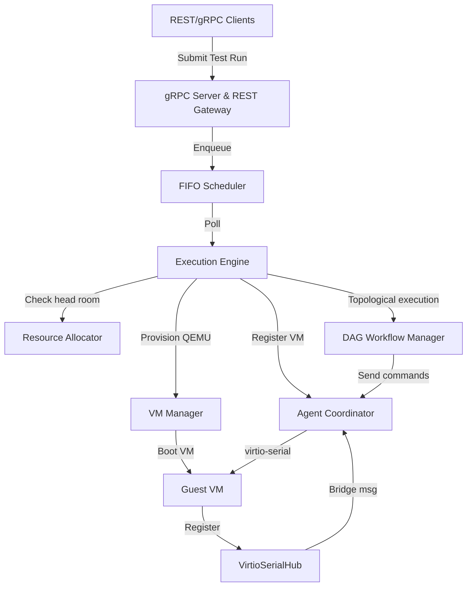

# Device Validation Framework (DVF) — Driver Validation Suite

The Device Validation Framework (DVF) is a production-grade, fault-tolerant, multi-node driver validation control plane and guest automation system. It orchestrates the lifecycle of virtual machines running custom QEMU simulated hardware devices, loads drivers under validation, executes structured tests, and captures high-performance telemetry and logging.

---

## 1. System Architecture

The DVF architecture consists of three core components:



### 1.1 Go Orchestrator (Control Plane)
The Orchestrator is a microservices-based control plane implemented in Go (1.22+). Its subcomponents include:
*   **Ingress Gateway**: A high-performance REST/gRPC API gateway providing endpoints to submit test runs, list running VMs, update heartbeats, and audit activities.
*   **FIFO Scheduler**: Orchestrates queueing of submitted `TestRun` requests, respecting priority and concurrency thresholds.
*   **Resource Allocator**: Tracks host CPU and memory budget dynamically. Prevents over-subscription of host resources during parallel VM execution.
*   **DAG Workflow Manager**: Evaluates multi-step test dependency trees defined in `suite.json`. Performs cycle detection, topological sorting, and parallel step dispatching. Supports per-step retry loops with exponential backoff.
*   **State Manager & Crash Recovery**: Reconciles the database (PostgreSQL/In-Memory) state on boot. Safely re-queues interrupted/crashed tests and cleans up orphan QEMU processes.
*   **Multi-Node Registry**: Coordinates distributed deployments using a thread-safe registry with TTL-based heartbeat eviction.

### 1.2 Python Guest Agent
A lightweight, dependency-free guest agent written in Python 3.
*   **Virtio-Serial Communication**: Bypasses guest TCP/IP networking completely, communicating via low-latency character devices (`/dev/virtio-ports/dvf.agent.0`).
*   **9p Filesystem mount**: Automatically mounts host shared directories (`/mnt/share`) to access test binaries and kernel modules.
*   **Driver & Device Management**: Dynamically loads kernel modules (`.ko`) and validates the presence of `/dev/gpgpu` character nodes.
*   **Structured Test Execution**: Runs compiled C validation test binaries, collects stdout/stderr logs, and parses output into standard JSON test reports.

### 1.3 VM Infrastructure
*   **VM Manager**: Automates QEMU process lifecycles, configuring memory size, CPU cores, custom PCI device arguments, and 9p share mounts.
*   **Virtio-Serial Hub**: Bridges host-side Unix sockets with QEMU guest virtio-serial channels. Handles JSON-RPC multiplexing.

---

## 2. Directory Structure

```
driver-validation-suite/
├── README.md                      # Project documentation
├── docker-compose.yml             # Dev database (Postgres) and cache (Redis)
├── configs/                       # Global orchestration configurations
│   ├── global_config.json
│   └── device_registry.json
├── go-orchestrator/               # Go Orchestrator source code
│   ├── cmd/orchestrator/          # main entry point
│   ├── internal/
│   │   ├── api/                   # REST/gRPC gateways
│   │   ├── cluster/               # Node heartbeat and cluster discovery
│   │   ├── config/                # Struct definitions and JSON loading
│   │   ├── core/                  # Scheduler, allocator, DAG workflow, and engine
│   │   ├── storage/               # PostgreSQL and Memory stores
│   │   ├── telemetry/             # Event bus (Redis streams)
│   │   └── vm/                    # QEMU manager and virtio-serial hub
│   └── proto/                     # Protocol Buffer definitions
├── python-agent/                  # Guest agent source code
│   └── agent/
│       ├── __init__.py
│       └── __main__.py            # Main loops and command handlers
├── test-suites/                   # Test suite definitions
│   ├── smoke/
│   ├── regression/
│   └── stress/
└── c-test-binaries/               # Compiled C validation tests
```

---

## 3. Getting Started

### 3.1 Prerequisites
*   Go 1.22 or higher
*   Python 3.8+
*   PostgreSQL & Redis (can be spun up via Docker Compose)
*   QEMU / KVM (for virtualization)

### 3.2 Running the Orchestrator
1. Spin up the background databases:
   ```bash
   docker-compose up -d
   ```
2. Build the orchestrator binary:
   ```bash
   cd go-orchestrator
   go build -o orchestrator ./cmd/orchestrator
   ```
3. Run the orchestrator with local config files:
   ```bash
   ./orchestrator --config configs --storage postgres
   ```

### 3.3 Running Unit Tests
Execute the entire test suite of the control plane:
```bash
cd go-orchestrator
go test ./...
```

---

## 4. REST APIs

*   `GET /healthz` - Check API server liveness
*   `GET /readyz` - Check storage & network readiness
*   `POST /test-runs` - Submit a new validation test run
*   `GET /test-runs/{id}` - View the status and results of a run
*   `GET /cluster/nodes` - List active orchestrator worker nodes
*   `POST /cluster/heartbeat` - Report node health
