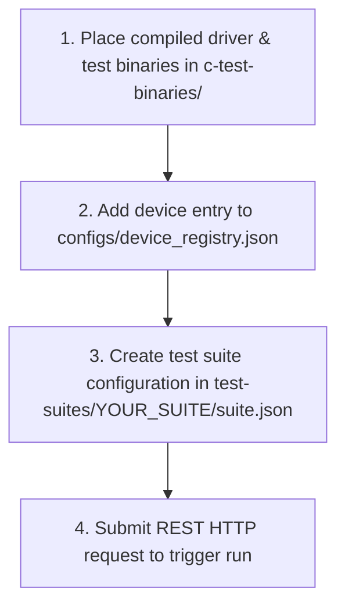

# User & Client Guide: Validating Custom QEMU Devices and Drivers

This guide outlines how to use the **Device Validation Framework (DVF)** to validate your custom QEMU simulated hardware devices and Linux kernel drivers. By following this guide, you can write tests, register devices, define test suites, and execute validation runs without needing to understand the inner workings of the orchestration control plane.

---

## 1. Step-by-Step Validation Workflow (What You Need to Do)

Do not worry about the internal gRPC channels or virtual machines. Testing a device and driver involves four concrete steps:



### Step 1: Copy files to `c-test-binaries/`
All drivers and test binaries must live on the host system under the `c-test-binaries/` directory. The framework automatically mounts this directory inside the guest VM under `/mnt/share`.
*   Your kernel module (e.g. `my_driver.ko`) should be placed in `c-test-binaries/drivers/my_driver.ko`.
*   Your compiled test binaries should be placed in `c-test-binaries/read_write/test_register_rw`, etc.

### Step 2: Register the custom device
Add your device inside the `"devices"` array in the host's `configs/device_registry.json` file:
```json
{
  "id": "my-custom-accel",
  "name": "My Custom AI Accelerator",
  "qemu_device_name": "custom-ai-accel",
  "driver_module": "my_accel_driver",
  "driver_path": "/mnt/share/drivers/my_accel_driver.ko",
  "device_node": "/dev/my_accel0",
  "target_modes": ["qemu"],
  "test_suites": ["smoke", "stress"]
}
```
*Note that the `driver_path` points to `/mnt/share/...` because that is where the guest OS sees it.*

### Step 3: Create the test suite configuration
Create a folder under the host's `test-suites/` directory (e.g., `test-suites/my-smoke-suite/`) and add a `suite.json` file inside it:
```json
{
  "id": "my-smoke-suite",
  "name": "Accelerator Smoke Test Suite",
  "description": "Validates register access and basic DMA functionality",
  "timeout_seconds": 180,
  "tests": [
    {
      "binary": "read_write/test_register_rw",
      "description": "Verifies basic register read/write operations",
      "timeout_seconds": 30
    },
    {
      "binary": "dma/test_dma_basic",
      "description": "Performs small-buffer DMA write/readback loops",
      "timeout_seconds": 60,
      "depends_on": ["read_write/test_register_rw"]
    }
  ]
}
```

### Step 4: Run the orchestrator and submit request
1. Start the orchestrator service on the host:
   ```bash
   ./orchestrator --config configs --storage memory
   ```
2. Trigger the validation run by sending an HTTP POST request:
   ```bash
   curl -X POST http://localhost:8080/test-runs \
     -H "Content-Type: application/json" \
     -d '{
       "device_id": "my-custom-accel",
       "test_suite_id": "my-smoke-suite",
       "priority": 1,
       "requested_by": "hardware-engineer"
     }'
   ```
3. The framework will automatically boot the VM, load your driver, verify `/dev/my_accel0` exists, run your test binaries in topological order, and shutdown the VM.

---

## 2. How to Write Test Binaries that Output JSON

The framework's guest agent executes each test binary and captures its standard output (`stdout`). To record individual test assertions, duration, and key hardware metrics, your binary **must print a structured JSON object to stdout** before exiting.

If the binary crashes or prints invalid JSON, the framework will capture the raw console output and mark the test step as `failed` or `errored`.

Below are complete, copy-pasteable templates for writing test binaries in C and Python.

### 2.1 C/C++ Test Binary Template
This example opens the device node, performs checks, measures latency, and outputs the structured JSON using standard `printf`.

```c
#include <stdio.h>
#include <stdlib.h>
#include <fcntl.h>
#include <unistd.h>
#include <time.h>

// Helper to get time in milliseconds
double get_time_ms() {
    struct timespec ts;
    clock_gettime(CLOCK_MONOTONIC, &ts);
    return (ts.tv_sec * 1000.0) + (ts.tv_nsec / 1000000.0);
}

int main() {
    double start_time = get_time_ms();
    
    // 1. Open the device node (provided by DVF mount)
    int fd = open("/dev/my_accel0", O_RDWR);
    if (fd < 0) {
        // Return structured failure JSON
        printf("{\n");
        printf("  \"results\": [\n");
        printf("    {\n");
        printf("      \"test\": \"open_device_node\",\n");
        printf("      \"status\": \"failed\",\n");
        printf("      \"duration_ms\": %.2f,\n");
        printf("      \"message\": \"Failed to open device node /dev/my_accel0\"\n");
        printf("    }\n");
        printf("  ]\n");
        printf("}\n");
        return 1; // Non-zero exit code indicates binary execution failure
    }

    // 2. Perform register write and read-back validation
    int test_passed = 1;
    char* err_msg = "Success";
    
    // [Place your custom hardware testing/register checking code here]
    // Example: write to BAR register and verify readback
    
    close(fd);
    double duration = get_time_ms() - start_time;

    // 3. Print the final JSON report to stdout
    printf("{\n");
    printf("  \"results\": [\n");
    printf("    {\n");
    printf("      \"test\": \"register_read_write\",\n");
    printf("      \"status\": \"%s\",\n", test_passed ? "passed" : "failed");
    printf("      \"duration_ms\": %.2f,\n", duration);
    printf("      \"message\": \"%s\",\n", err_msg);
    printf("      \"metrics\": {\n");
    printf("        \"register_read_latency_ns\": 42.5\n"); // Optional custom telemetry metrics
    printf("      }\n");
    printf("    }\n");
    printf("  ]\n");
    printf("}\n");

    return test_passed ? 0 : 1;
}
```

### 2.2 Python Test Script Template
If you prefer scripting, you can write tests in Python. The guest OS has Python installed.

```python
#!/usr/bin/env python3
import sys
import os
import json
import time

def run_test():
    start_time = time.time()
    device_path = "/dev/my_accel0"
    
    # Verify device node exists
    if not os.path.exists(device_path):
        result = {
            "test": "verify_device_exists",
            "status": "failed",
            "duration_ms": (time.time() - start_time) * 1000.0,
            "message": f"Device node {device_path} not found."
        }
        print(json.dumps({"results": [result]}, indent=2))
        sys.exit(1)

    try:
        # Open device node and perform checks
        with open(device_path, "r+b", buffering=0) as f:
            # [Place your custom device reads/writes/ioctls here]
            pass
            
        duration_ms = (time.time() - start_time) * 1000.0
        result = {
            "test": "dma_ping_pong",
            "status": "passed",
            "duration_ms": duration_ms,
            "message": "DMA validation complete",
            "metrics": {
                "throughput_mbps": 750.8
            }
        }
        print(json.dumps({"results": [result]}, indent=2))
        sys.exit(0)
        
    except Exception as e:
        duration_ms = (time.time() - start_time) * 1000.0
        result = {
            "test": "dma_ping_pong",
            "status": "failed",
            "duration_ms": duration_ms,
            "message": f"Exception encountered: {str(e)}"
        }
        print(json.dumps({"results": [result]}, indent=2))
        sys.exit(1)

if __name__ == "__main__":
    run_test()
```

---

## 3. Custom Telemetry Metrics

You can define any arbitrary keys in the `"metrics"` dictionary of your JSON outputs. These are parsed by the DVF telemetry subsystem and streamed to the Prometheus / Redis Stream telemetry bus for dashboard plotting.
*   *Recommended Metrics*: `throughput_mbps`, `interrupt_latency_us`, `error_rate`, `dma_transfer_time_ms`.
